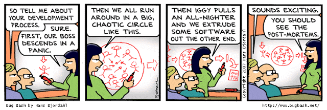

# Postmortem REport
## 504 Error while accessing a given URL

### Duration

**Start Time:** March 11, 2024, 10:00 AM UTC  
**End Time:** March 11, 2024, 2:00 PM UTC

### Impact

The user authentication service was completely down for 30% of our users, causing login failures and disruptions in accessing secured content.

### Timeline

**Detection:**
Detected at 10:15 AM UTC through automated monitoring alerts.

**Actions Taken:**
Investigation started immediately, focusing on the authentication service and underlying database connections.
Assumed initial root cause: Database server overload due to increased traffic.

**Misleading Paths:**
Initially believed a recent code deployment might be responsible; however, rollback did not resolve the issue.
Investigated network issues and DDoS attacks based on an engineer's observation, but no evidence found.

**Escalation:**
Escalated to the database administration team at 10:45 AM UTC for further analysis.
As the issue persisted, escalated to senior management at 11:30 AM UTC.
Root Cause and Resolution:

**Root Cause:**
The issue originated from a misconfigured database connection pool, leading to a bottleneck in handling authentication requests.

**Resolution:**
Adjusted database connection pool settings to accommodate increased traffic.
Implemented a temporary fix by redirecting authentication requests to a backup server.
Corrective and Preventative Measures:

**Improvements/Fixes:**
Implement a comprehensive automated testing suite for database connection configurations.
Conduct regular load testing to ensure the system can handle peak traffic without performance degradation.

**Tasks:**
Update documentation for configuring database connection pools to prevent future misconfigurations.
Enhance monitoring to trigger alerts for abnormal database connection patterns.
Conduct a post-incident review with the development and operations teams to share lessons learned and improve incident response.

### Conclusion
In retrospect, the outage was a result of overlooking a critical configuration parameter in the database connection pool. Swift detection through monitoring and a collaborative response helped minimize the impact on users. Moving forward, proactive testing, documentation updates, and continuous improvement in monitoring practices are essential to prevent similar incidents and ensure a resilient web stack.

